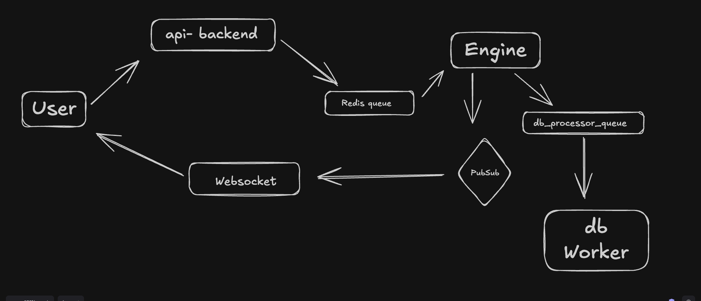

# 🚀 BeeNance Exchange

A high-performance cryptocurrency exchange built using a microservice architecture with separate components for order processing, WebSocket communication, API and DB.

---

## 📖 Overview

This project simulates the architecture used by modern exchanges.

The system is designed to:

- Process orders asynchronously using Redis queues.
- Execute matching logic inside a dedicated Engine service ( in memory order processing).
- Broadcast market updates through WebSockets.
- Persist trades and order book updates using background workers.

---

## 🏗️ Architecture

<p align="center">
  
</p>

---

## ⚙️ Components

### 1. API Backend

Responsible for:

- User authentication
- Order placement
- Order cancellation
- Pushing incoming requests to Redis queues

**Folder**

```text
exchange-api-backend/
```

---

### 2. Engine

Core matching engine responsible for:

- Processing incoming orders
- Maintaining the order book
- Matching buy and sell orders
- Publishing updates via Pub/Sub
- Sending database persistence events

**Folder**

```text
engine/
```

---

### 3. WebSocket Server

Responsible for:

- Real-time market updates
- Trade notifications
- Order book streaming
- Client subscriptions

**Folder**

```text
ws/
```

---

### 4. DB Worker

Background service responsible for:

- Consuming database jobs
- Persisting trades
- Persisting order updates
- Reducing load on the matching engine

**Folder**

```text
dbWorker/
```

---

### 5. Frontend

User interface for traders.

Features:

- Place orders
- View live order book
- Real-time updates through WebSockets

**Folder**

```text
frontend/
```

---

## 🔄 Order Flow

### Step 1

User submits an order through the frontend.

```text
Frontend → API Backend
```

### Step 2

API Backend validates the request and pushes it to Redis.

```text
API Backend → Redis Queue
```

### Step 3

Engine consumes the order from Redis.

```text
Redis Queue → Engine
```

### Step 4

Engine updates the order book and matches orders.

```text
Engine → Matching Logic
```

### Step 5

Engine publishes updates.

```text
Engine → Pub/Sub
```

### Step 6

WebSocket server broadcasts updates to connected clients.

```text
Pub/Sub → WebSocket → User
```

### Step 7

Engine sends persistence events.

```text
Engine → DB Processor Queue
```

### Step 8

DB Worker stores data in the database.

```text
DB Processor Queue → DB Worker → Database
```

---

## 🛠️ Tech Stack

### Backend

- Node.js
- TypeScript
- Redis
- WebSockets

### Frontend

- React
- TypeScript

### Infrastructure

- Redis Queues
- Pub/Sub Architecture

---

## 📂 Project Structure

```text
.
├── frontend/
├── engine/
├── exchange-api-backend/
├── ws/
├── dbWorker/
├── Architecture.png
└── README.md
```


---

## 🚦 Future Improvements


- Matching engine efficiency
- Docker Compose setup
- Rate limiting
- Advanced order types
- User portfolio tracking

---
